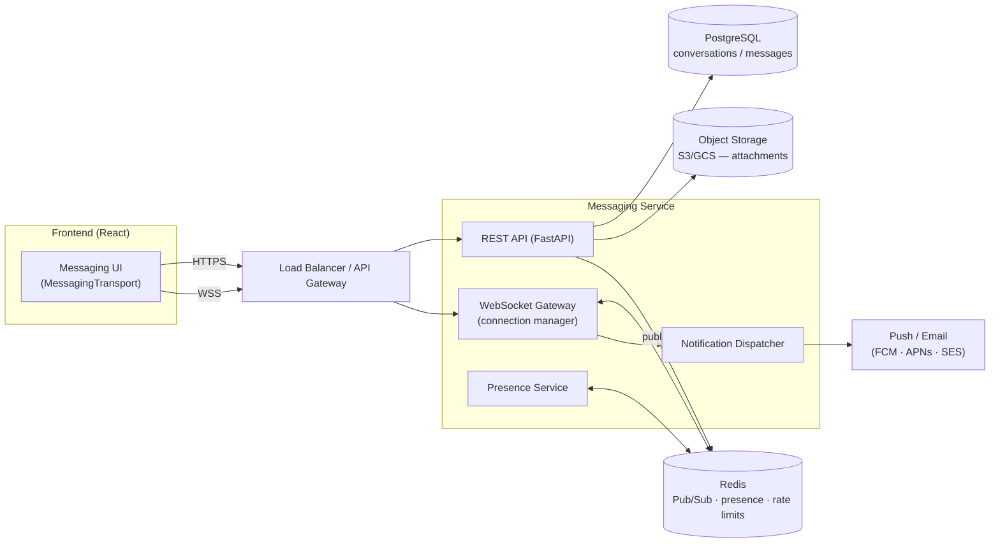
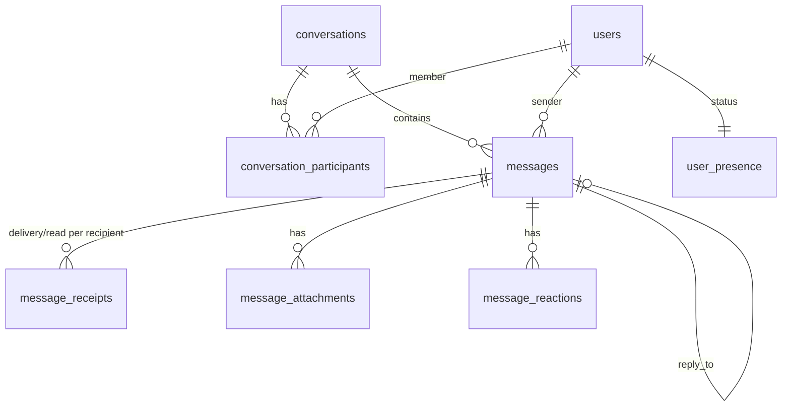
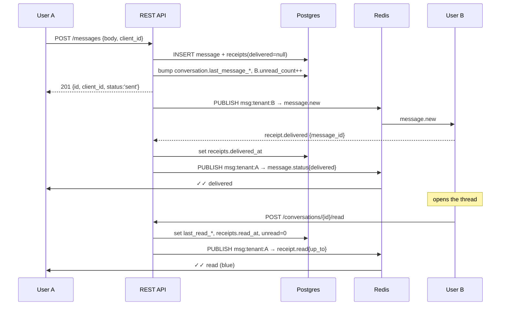
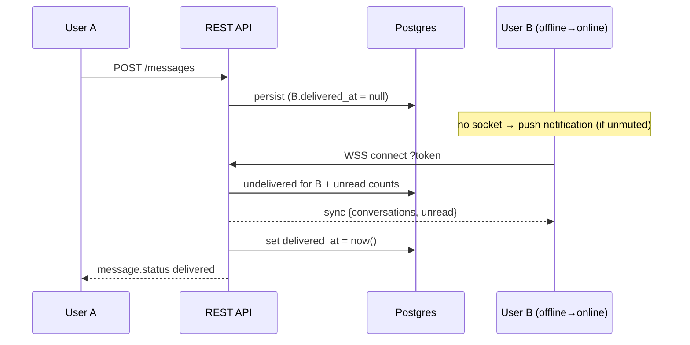
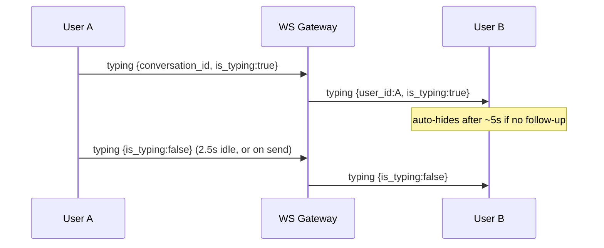
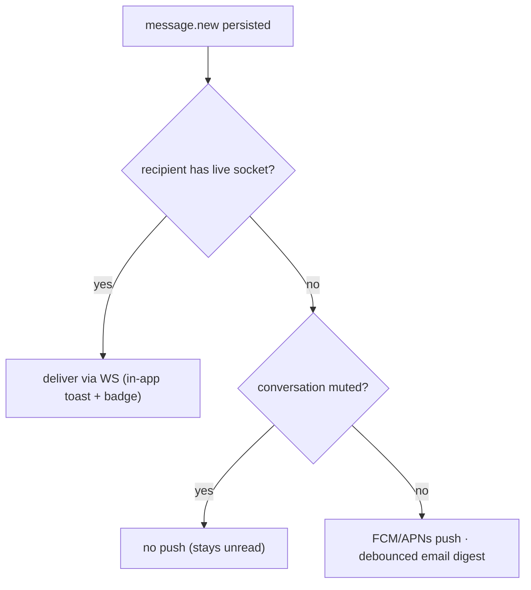
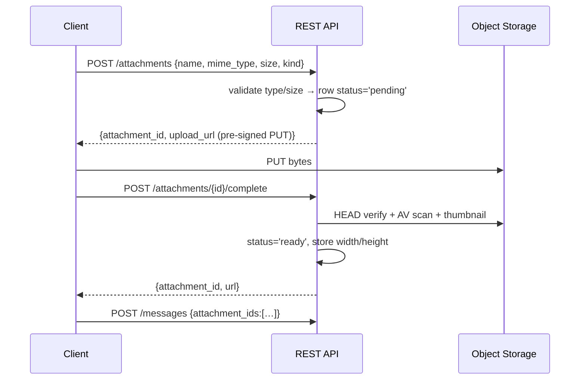

# DentC Direct Messaging — Backend Hand-off

**Single source of truth for the backend team.** Self-contained: architecture, data model, REST + WebSocket
API, flows, security, scale, gap list, phasing, and cut-over steps. No other document is required to start.

| | |
|---|---|
| **Feature** | User-to-user Direct Messaging (staff ↔ staff), replacing the retired AI-chat assistant |
| **Frontend status** | ✅ Built, live-verified, `tsc` + `eslint` clean. Runs on a client-side simulation until this backend exists |
| **Backend status** | ❌ Nothing exists. No messaging tables, endpoints, WebSocket, or presence service |
| **Already available** | `GET /api/v1/users` (the people directory) — used as-is, no changes required |
| **Cut-over** | Implement §5–§6, set `VITE_MESSAGING_BACKEND=api`. **Zero frontend rewrites** |
| **Phase 1 scope** | 1:1 direct messages only. Schema is group-ready (see §16) |

**Conventions (repo-wide, see `CLAUDE.md`):** all data/API field identifiers are **snake_case**; backend is the
source of truth; everything is **tenant-scoped** (`tenant_id`); auth is the existing JWT bearer scheme.

---

## Table of Contents

1. [What the frontend already does](#1-what-the-frontend-already-does)
2. [Scope, phasing & acceptance criteria](#2-scope-phasing--acceptance-criteria)
3. [System architecture](#3-system-architecture)
4. [Data model](#4-data-model)
5. [REST API](#5-rest-api)
6. [WebSocket protocol](#6-websocket-protocol)
7. [Core flows (sequence diagrams)](#7-core-flows-sequence-diagrams)
8. [Presence, typing, receipts & notifications](#8-presence-typing-receipts--notifications)
9. [Attachments & media storage](#9-attachments--media-storage)
10. [Pagination & search](#10-pagination--search)
11. [Security, permissions & validation](#11-security-permissions--validation)
12. [Rate limiting & error handling](#12-rate-limiting--error-handling)
13. [Scalability, performance & indexing](#13-scalability-performance--indexing)
14. [Existing endpoint we depend on (`/users`)](#14-existing-endpoint-we-depend-on-users)
15. [Gap list (MSG-1 … MSG-11)](#15-gap-list-msg-1--msg-11)
16. [Future extensibility](#16-future-extensibility)
17. [Cut-over checklist & open questions](#17-cut-over-checklist--open-questions)

---

## 1. What the frontend already does

Everything below is **implemented and working today** against a local simulation. The backend's job is to
replace the simulation, not to design behaviour — match the contracts in §5/§6 and it lights up.

**Surfaces**
- Floating launcher + slide-in two-pane panel (available on every screen).
- Full-page route `/messages`.

**Behaviour already built**
- Unified left rail: one search box searching **both** existing conversations (client-side) and the **whole
  org directory** (server-side). Sections render as `CONVERSATIONS` + `PEOPLE (n)`.
- Selecting a person **resumes** the existing thread if one exists, else creates a new one. People who
  already have a conversation are de-duplicated out of the `PEOPLE` list.
- Conversation list: last-message preview, timestamp, unread badge, pinned / muted / archived, presence dot.
- Thread: date separators, message grouping, infinite scroll back through history.
- Message features: markdown rich text, emoji picker, file + image attachments (drag-drop), image lightbox,
  reactions, reply-with-quote, forward, edit, delete-for-me / delete-for-everyone, copy, multi-select bulk
  actions.
- Delivery lifecycle rendered as ticks: **sending → sent → delivered → read**.
- Typing indicators, presence (online / away / offline + last-seen), read receipts.
- Notifications: in-app toast, unread badge, `document.title` count, notification sound.
- Responsive desktop / tablet / mobile; loading, empty, and error states throughout.

**Client-side contracts the backend must honour**
- Optimistic send reconciled by **`client_id`** (so sends must be idempotent).
- Messages de-duplicated by **`id`** (so at-least-once WebSocket delivery is safe).
- History paginated by **`before` cursor** → `{ items, has_more, cursor }`.
- Drafts stay **client-side** — do **not** build a server draft store.

**The single swap point:** `src/features/messaging/messagingService.ts` chooses between
`LocalMessagingTransport` (simulation) and `RealMessagingTransport` (this spec) via `VITE_MESSAGING_BACKEND`.
`realTransport.ts` already maps every endpoint and event named below, 1:1.

---

## 2. Scope, phasing & acceptance criteria

Ship in this order — each phase is independently useful and unblocks visible frontend behaviour.

### P0 — Core messaging (unblocks everything)
`MSG-1` schema · `MSG-2` REST · `MSG-3` WebSocket gateway

**Done when:** two users in different browsers can open a conversation, exchange messages in real time,
history survives reload, and the conversation list shows correct unread counts and last-message previews.

### P1 — Fidelity (makes the existing UI truthful)
`MSG-4` presence · `MSG-5` delivery/read receipts · `MSG-6` attachments

**Done when:** ticks progress sent → delivered → read against real recipients; presence dots and "last seen"
are real; images/files upload to object storage and render for both parties.

### P2 — Production hardening
`MSG-7` push notifications · `MSG-8` server search · `MSG-9` rate limiting + abuse · `MSG-10` audit/retention

**Done when:** offline users get push, message search works server-side, abuse controls are enforced, and
message history satisfies the practice's retention/e-discovery posture.

### Out of scope for Phase 1
Group chats, channels, threads, voice/video calls (schema is prepared — see §16).

---

## 3. System architecture

REST is the **source of truth**; WebSocket is a **delivery channel only**. Every real-time event has durable
REST state behind it, so a client that misses events recovers by refetching.



**Why Redis Pub/Sub:** a write publishes to each recipient's channel `msg:{tenant_id}:{user_id}`. Every
gateway node subscribes only for the users it currently holds sockets for. This means **no sticky sessions
are required for correctness** — a user can have sockets on several nodes/tabs — and the WS tier scales by
adding nodes.

**Ordering:** sort by `created_at`, then `id`. Use **UUIDv7** for `messages.id` so ids are time-sortable —
this makes keyset pagination trivial and avoids leaking row counts.

---

## 4. Data model

PostgreSQL. Every table carries `tenant_id` and is always filtered by it. Timestamps are `timestamptz` (UTC).



```sql
-- Conversation container (1:1 today; N participants supported).
CREATE TABLE conversations (
  id              uuid PRIMARY KEY DEFAULT gen_random_uuid(),
  tenant_id       bigint NOT NULL,
  type            text   NOT NULL DEFAULT 'direct',   -- 'direct' | 'group' (future)
  title           text,                               -- null for 1:1 (derived from peer)
  dedupe_key      text,                               -- 'dm:<lowId>:<highId>' — see below
  created_by      bigint NOT NULL,
  last_message_id uuid,                               -- denormalized for list sorting
  last_message_at timestamptz,
  created_at      timestamptz NOT NULL DEFAULT now(),
  updated_at      timestamptz NOT NULL DEFAULT now()
);

-- Membership + PER-USER conversation state (each side controls their own view).
CREATE TABLE conversation_participants (
  id                   bigserial PRIMARY KEY,
  tenant_id            bigint NOT NULL,
  conversation_id      uuid   NOT NULL REFERENCES conversations(id) ON DELETE CASCADE,
  user_id              bigint NOT NULL,
  role                 text   NOT NULL DEFAULT 'member',
  is_pinned            boolean NOT NULL DEFAULT false,
  is_muted             boolean NOT NULL DEFAULT false,
  is_archived          boolean NOT NULL DEFAULT false,
  is_blocked           boolean NOT NULL DEFAULT false,   -- this user blocked the other
  last_read_message_id uuid,
  last_read_at         timestamptz,
  unread_count         integer NOT NULL DEFAULT 0,
  joined_at            timestamptz NOT NULL DEFAULT now(),
  left_at              timestamptz,                      -- per-user soft delete
  UNIQUE (conversation_id, user_id)
);

CREATE TABLE messages (
  id                   uuid PRIMARY KEY DEFAULT gen_random_uuid(),  -- UUIDv7 recommended
  tenant_id            bigint NOT NULL,
  conversation_id      uuid   NOT NULL REFERENCES conversations(id) ON DELETE CASCADE,
  sender_id            bigint NOT NULL,
  body                 text   NOT NULL DEFAULT '',       -- markdown; '' allowed if attachments exist
  reply_to_id          uuid   REFERENCES messages(id) ON DELETE SET NULL,
  forwarded_from       text,                             -- display name of original sender
  client_id            text,                             -- idempotency key from the client
  is_edited            boolean NOT NULL DEFAULT false,
  edited_at            timestamptz,
  deleted_for_everyone boolean NOT NULL DEFAULT false,   -- tombstone, body cleared
  deleted_at           timestamptz,
  created_at           timestamptz NOT NULL DEFAULT now()
);

-- Per-recipient delivery/read state (one row per recipient; group-ready).
CREATE TABLE message_receipts (
  id           bigserial PRIMARY KEY,
  tenant_id    bigint NOT NULL,
  message_id   uuid   NOT NULL REFERENCES messages(id) ON DELETE CASCADE,
  user_id      bigint NOT NULL,
  delivered_at timestamptz,
  read_at      timestamptz,
  UNIQUE (message_id, user_id)
);

-- Attachment metadata (bytes live in object storage).
CREATE TABLE message_attachments (
  id          uuid PRIMARY KEY DEFAULT gen_random_uuid(),
  tenant_id   bigint NOT NULL,
  message_id  uuid REFERENCES messages(id) ON DELETE CASCADE,  -- null until the message is committed
  uploader_id bigint NOT NULL,
  kind        text   NOT NULL,                    -- 'image' | 'file'
  name        text   NOT NULL,
  mime_type   text   NOT NULL,
  size_bytes  bigint NOT NULL,
  storage_key text   NOT NULL,
  width       integer,
  height      integer,
  status      text   NOT NULL DEFAULT 'pending',  -- 'pending' | 'ready' | 'blocked'
  created_at  timestamptz NOT NULL DEFAULT now()
);

CREATE TABLE message_reactions (
  id         bigserial PRIMARY KEY,
  tenant_id  bigint NOT NULL,
  message_id uuid   NOT NULL REFERENCES messages(id) ON DELETE CASCADE,
  user_id    bigint NOT NULL,
  emoji      text   NOT NULL,
  created_at timestamptz NOT NULL DEFAULT now(),
  UNIQUE (message_id, user_id, emoji)
);

CREATE TABLE user_presence (
  tenant_id    bigint NOT NULL,
  user_id      bigint NOT NULL,
  status       text   NOT NULL DEFAULT 'offline',  -- 'online' | 'away' | 'offline'
  last_seen_at timestamptz,
  updated_at   timestamptz NOT NULL DEFAULT now(),
  PRIMARY KEY (tenant_id, user_id)
);

CREATE TABLE message_reports (          -- abuse reporting (P2)
  id               bigserial PRIMARY KEY,
  tenant_id        bigint NOT NULL,
  reporter_id      bigint NOT NULL,
  reported_user_id bigint,
  message_id       uuid,
  reason           text NOT NULL,
  details          text,
  created_at       timestamptz NOT NULL DEFAULT now()
);
```

### Design notes that matter
- **`dedupe_key` is what makes "resume the existing chat" work.** Compute
  `'dm:' || least(a,b) || ':' || greatest(a,b)` and enforce a unique index. `POST /conversations` must be a
  **get-or-create upsert** — the frontend calls it every time a user is picked from the directory and relies
  on receiving the *same* conversation back.
- **Per-user flags live on `conversation_participants`,** not `conversations` — pin/mute/archive/block are
  each user's own view of a shared thread.
- **Delete is a per-user soft delete** (`left_at`). Never hard-delete shared history; the other participant
  keeps their copy.
- **`message_receipts` is a table, not two columns on `messages`** — so group chat needs no schema change.
- **`message_attachments.message_id` is nullable** so the client can upload *before* the message is sent,
  then link on send.

---

## 5. REST API

Base path `/api/v1/messaging`. Auth: `Authorization: Bearer <jwt>`. Tenant is derived from the token — never
accept it from the client.

| Method | Path | Purpose |
|---|---|---|
| `GET` | `/conversations?page=&size=&search=&archived=` | My conversations (paginated, with unread + last message) |
| `POST` | `/conversations` | **Get-or-create** 1:1 (`{ participant_id }`) — idempotent |
| `GET` | `/conversations/{id}` | One conversation + my participant state |
| `PATCH` | `/conversations/{id}` | My flags: `pinned` / `muted` / `archived` / `blocked` |
| `DELETE` | `/conversations/{id}` | Remove from **my** list (per-user soft delete) |
| `POST` | `/conversations/{id}/read` | Mark read (`{ up_to_message_id? }`, default latest) |
| `GET` | `/conversations/{id}/messages?before=&limit=` | History — **keyset** pagination |
| `POST` | `/conversations/{id}/messages` | Send |
| `PATCH` | `/conversations/{id}/messages/{mid}` | Edit body (sender only, within window) |
| `DELETE` | `/conversations/{id}/messages/{mid}?for_everyone=` | Delete for me / everyone |
| `POST` | `/conversations/{id}/messages/{mid}/reactions` | Toggle `{ emoji }` → returns full reaction set |
| `POST` | `/messages/{mid}/forward` | Forward to `{ participant_ids: [] }` |
| `POST` | `/attachments` | Begin upload → pre-signed URL + attachment id |
| `POST` | `/attachments/{id}/complete` | Finish upload → validate, set `ready` |
| `GET` | `/presence?user_ids=1,2,3` | Presence snapshot |
| `GET` | `/search?q=&limit=` | Full-text search across my messages |
| `POST` | `/reports` | Report a user/message |

### Object shapes

**Conversation**
```json
{
  "id": "0f2b…",
  "type": "direct",
  "participant_ids": ["12", "83867"],
  "peer": {
    "id": "83867", "name": "Dhileep Jinna", "username": "dhileep",
    "email": "dhileep.jin2829@dental.local", "role": "provider",
    "avatar_url": null, "initials": "DJ"
  },
  "last_message": null,
  "unread_count": 0,
  "pinned": false, "muted": false, "archived": false, "blocked": false,
  "created_at": "2026-07-19T15:32:00Z",
  "updated_at": "2026-07-19T15:32:00Z"
}
```
> `peer` is **denormalized on purpose** — the conversation list must render in one query with no N+1.

**Message**
```json
{
  "id": "018f…",
  "conversation_id": "0f2b…",
  "sender_id": "12",
  "body": "Is the 2pm crown appointment confirmed?",
  "status": "sent",
  "client_id": "msg_k2a…",
  "reply_to": {
    "message_id": "018e…", "sender_id": "83867",
    "sender_name": "Dhileep Jinna", "preview": "Running late…"
  },
  "forwarded_from": null,
  "attachments": [
    { "id": "a1…", "kind": "image", "name": "xray.png", "mime_type": "image/png",
      "size": 84213, "url": "https://…signed", "width": 1200, "height": 800 }
  ],
  "reactions": [ { "emoji": "👍", "user_ids": ["83867"] } ],
  "edited_at": null,
  "deleted_for_everyone": false,
  "created_at": "2026-07-19T15:32:04Z"
}
```

### Worked examples

**Get-or-create a conversation** (called every time a user is picked in the rail):
```http
POST /api/v1/messaging/conversations
{ "participant_id": 83867 }
```
→ `200` with the **existing** conversation if one exists, `201` with a new one otherwise. Must never create
a duplicate for the same pair.

**Send**
```http
POST /api/v1/messaging/conversations/0f2b…/messages
{ "body": "Is the 2pm crown appointment confirmed?",
  "client_id": "msg_k2a…", "reply_to_id": null, "attachment_ids": [] }
```
→ `201` with the Message above. Re-sending the same `client_id` returns the **original** message (no dupe).

**History (keyset)**
```http
GET /api/v1/messaging/conversations/0f2b…/messages?before=018f…&limit=30
```
```json
{ "items": [ /* ascending, oldest→newest */ ], "has_more": true, "cursor": "018e…" }
```

**Mark read**
```http
POST /api/v1/messaging/conversations/0f2b…/read
{ "up_to_message_id": "018f…" }
```
```json
{ "conversation_id": "0f2b…", "unread_count": 0, "last_read_message_id": "018f…" }
```

**Toggle reaction** → returns the *whole* set so the client can replace state wholesale:
```json
{ "reactions": [ { "emoji": "👍", "user_ids": ["83867"] } ] }
```

---

## 6. WebSocket protocol

```
wss://<host>/api/v1/messaging/ws?token=<access_token>
```

The browser cannot set headers on a WS handshake, so the JWT goes in the query string (same pattern the
retired AI-chat socket used). Validate on connect; reject with close code **`4401`** if invalid/expired.

On connect, send `connection.ack` then a `sync` warm-up snapshot so the client needs no extra REST calls:

```json
{ "type": "connection.ack", "session_id": "sess_abc", "server_time": "2026-07-19T15:30:00Z" }
{ "type": "sync",
  "conversations": [ /* Conversation[] with unread + last_message */ ],
  "unread": [ { "conversation_id": "0f2b…", "unread_count": 2 } ] }
```

### Server → Client

| type | payload |
|---|---|
| `message.new` | `{ conversation_id, message }` |
| `message.updated` | `{ conversation_id, message }` |
| `message.deleted` | `{ conversation_id, message_id, for_everyone }` |
| `message.status` | `{ conversation_id, message_id, status }` |
| `receipt.read` | `{ conversation_id, reader_id, up_to_message_id, read_at }` |
| `reaction.updated` | `{ conversation_id, message_id, reactions[] }` |
| `typing` | `{ conversation_id, user_id, is_typing }` |
| `presence` | `{ user_id, status, last_seen }` |
| `conversation.updated` | `{ conversation }` |
| `error` | `{ error: { code, message, retry_after? } }` |

### Client → Server

| type | payload |
|---|---|
| `ping` | `{}` — every ~30s, refreshes presence TTL |
| `typing` | `{ conversation_id, is_typing }` |
| `receipt.delivered` | `{ message_id }` |
| `presence` | `{ status }` — `online` / `away` on tab visibility |

> **Durable writes go over REST**, not WebSocket — that keeps them idempotent and retryable. The socket only
> carries the resulting broadcasts plus the four ephemeral client frames above.

**Token expiry mid-connection:** track `exp`; emit `error{code:'AUTH_EXPIRED'}` and close `4401`. The client
already refreshes and reconnects with exponential backoff (max 5 attempts).

---

## 7. Core flows (sequence diagrams)

**Send → deliver → read (both online)**



**Recipient offline → reconnect backlog**



**Typing (ephemeral — never touches Postgres)**



---

## 8. Presence, typing, receipts & notifications

**Presence** — Redis-first with a periodic Postgres snapshot.
- On WS connect: `presence:{tenant}:{user} = online` with a **45s TTL**; client `ping` every 30s refreshes it.
- `away` is client-driven (tab `visibilitychange`) and simply relayed.
- On disconnect / TTL expiry: mark `offline`, write `user_presence.last_seen_at`, broadcast.
- **Multiple tabs/devices:** reference-count sockets per user; only go `offline` when the count hits zero.
- **Fan-out scope:** only publish a user's presence to users who share a conversation with them, plus
  on-demand directory lookups via `GET /presence`. Do not broadcast everyone to everyone.

**Receipts**
- `delivered_at` — set when a recipient's socket receives the message (or on reconnect backlog flush).
- `read_at` — set by `POST /read`; batch it (`UPDATE … WHERE message_id IN (…)`) and broadcast **one**
  `receipt.read` with `up_to_message_id` rather than one event per message.
- The sender's tick shows the **minimum** state across recipients (for 1:1, just the peer's).

**Notifications**

In-app notifications are **already implemented client-side**. The backend only needs the out-of-app path
(P2): push for recipients with no live socket and an unmuted conversation, honouring per-user prefs, with
de-dupe and per-conversation coalescing.

---

## 9. Attachments & media storage

Two-phase, direct-to-storage — bytes never transit the API server.



- **Validate before issuing the URL:** MIME allowlist (images, PDF, common docs), max **25 MB**/file,
  10 attachments and 50 MB per message. Reject executables/scripts.
  *(The simulation caps inline data-URLs at 3 MB — that's a demo limitation, not a product requirement.)*
- **Private buckets only.** All reads/writes via short-lived (~5 min) pre-signed URLs, authorized by checking
  the requester is a participant of the attachment's conversation.
- Key layout: `tenant/{tenant_id}/conversations/{conversation_id}/{attachment_id}/{filename}`.
- Serve downloads with `Content-Disposition: attachment`; front image reads with a CDN using signed URLs.
- Deleting a message for-everyone should schedule its attachments for deletion (with an audit grace period).

---

## 10. Pagination & search

**Conversations** — page/size (1-based), ordered `pinned DESC, last_message_at DESC`. Return the standard
DentC envelope: `{ items, meta: { page, size, total, pages } }`.

**Messages** — **keyset, not offset.** A hot thread mutates constantly and offset paging skips/duplicates rows:
```sql
SELECT * FROM messages
WHERE conversation_id = :id AND id < :before
ORDER BY id DESC LIMIT :limit;   -- reverse for display
```
Response `{ items, has_more, cursor }` where `cursor` is the oldest returned `id`. Default limit 30, cap 100.
**The frontend already consumes exactly this shape.**

**Message search (P2)** — Postgres FTS scoped to the caller's conversations:
```sql
ALTER TABLE messages ADD COLUMN body_tsv tsvector
  GENERATED ALWAYS AS (to_tsvector('english', coalesce(body,''))) STORED;
CREATE INDEX ix_messages_body_tsv ON messages USING GIN (body_tsv);
```
Always constrain by `tenant_id` **and** participant membership — never leak messages from conversations the
caller isn't in. If volume warrants later, mirror into OpenSearch and keep FTS as fallback.

**People search** reuses the existing `/api/v1/users` — see §14.

---

## 11. Security, permissions & validation

**Non-negotiables**
- **Tenant isolation on every query.** Cross-tenant messaging is forbidden; cross-tenant ids must return
  `404`, never `403` (no existence leak).
- **Authorize every access:** participant check on all conversation/message/attachment reads and writes.
- TLS everywhere (HTTPS/WSS); validate WS `Origin` against an allowlist.
- Use UUIDs for ids **and** still authorize — never rely on unguessability (IDOR).
- **Treat `body` as untrusted.** Store raw markdown; never return HTML. The client renders with a sanitizing
  markdown renderer (no raw HTML, links forced to `rel="noopener noreferrer"`).
- **PHI posture:** staff will discuss patients in these threads. Apply the same encryption-at-rest, access
  logging, and retention rules as other PHI-adjacent DentC data. Log edits/deletes for e-discovery.

**Permission matrix**

| Action | Allowed for |
|---|---|
| Read conversation / messages | participants only |
| Send message | participants; sender not blocked by recipient |
| Edit message | **sender only**, within edit window (suggest 15 min), not deleted |
| Delete **for me** | any participant (hides their own copy) |
| Delete **for everyone** | **sender only**, within window (suggest 60 min) → tombstone |
| React | participants |
| Pin / mute / archive / block / delete-conversation | affects **only the caller's** participant row |
| Start conversation | any active user with another active user **in the same tenant** |
| View presence | users sharing a conversation, or an explicit directory lookup |

*All staff can message each other by default. If the practice later wants role restrictions (e.g. front-desk
cannot DM providers), the participant check is the single place to extend.*

**Validation rules**
- `body` ≤ **8000** chars; may be empty only if `attachment_ids` is non-empty; strip NUL/control chars.
- `client_id` ≤ 64 chars, unique per conversation.
- `reply_to_id` / `attachment_ids` must belong to the **same** conversation + tenant, else `422`.
- `emoji`: single grapheme from an allowlist, ≤ 16 bytes.
- `participant_id`: active user, same tenant, not self, hasn't blocked the caller.
- Conversation flags are booleans only.

---

## 12. Rate limiting & error handling

**Redis token buckets** (per user; per IP for connects):

| Action | Suggested limit |
|---|---|
| Send message | 20 / 10s burst, 600 / hour |
| Typing frames | coalesce; ≤ 1 / 2s per conversation |
| Reactions / edits | 60 / min |
| Create conversation | 30 / hour (anti-spam) |
| WS connects | 10 / min |

**Error envelope** (matches the existing DentC `ErrorResponse`):
```json
{ "error": { "code": "MESSAGE_TOO_LONG", "message": "Message exceeds 8000 characters.", "details": null } }
```

| HTTP | code |
|---|---|
| 400 | `VALIDATION_ERROR` |
| 401 | `UNAUTHENTICATED` |
| 403 | `FORBIDDEN` / `BLOCKED` |
| 404 | `NOT_FOUND` (also for cross-tenant) |
| 409 | `CONFLICT` |
| 413 | `ATTACHMENT_TOO_LARGE` |
| 415 | `UNSUPPORTED_MEDIA_TYPE` |
| 429 | `RATE_LIMITED` (+ `retry_after`) |
| 500 | `INTERNAL` |

WS errors use `{ "type":"error", "error":{ code, message, retry_after? } }` and must **not** kill the socket
(except auth failures → close `4401`).

---

## 13. Scalability, performance & indexing

- **Stateless REST** behind autoscaling; **WS gateway** scales horizontally via Redis Pub/Sub (no shared
  in-process state). Budget a few thousand sockets per node; scale on concurrent-connection metrics.
- **Denormalize** `last_message_id` / `last_message_at` / `unread_count` so the conversation list is one
  indexed query with no N+1.
- **Partition `messages`** by month (range) or `tenant_id` (hash) once large; read replicas for history/search.
- **Backpressure:** cap per-socket send queues; drop ephemeral events (typing/presence) first under pressure —
  never drop a persisted `message.new` (it's recoverable via REST).
- **At-least-once is safe** — clients de-dupe by `id`.

```sql
-- 1:1 dedupe — this is what makes "resume existing chat" correct.
CREATE UNIQUE INDEX uq_conv_dedupe ON conversations (tenant_id, dedupe_key)
  WHERE type = 'direct' AND dedupe_key IS NOT NULL;

CREATE INDEX ix_participants_user ON conversation_participants (tenant_id, user_id);
CREATE INDEX ix_participants_conv ON conversation_participants (conversation_id, user_id);

-- Keyset history scan (UUIDv7 is time-sortable).
CREATE INDEX ix_messages_conv_id      ON messages (conversation_id, id DESC);
CREATE INDEX ix_messages_conv_created ON messages (conversation_id, created_at DESC);

-- Idempotent sends.
CREATE UNIQUE INDEX uq_messages_client ON messages (conversation_id, client_id)
  WHERE client_id IS NOT NULL;

CREATE INDEX ix_receipts_user_undelivered ON message_receipts (user_id) WHERE delivered_at IS NULL;
CREATE INDEX ix_receipts_message   ON message_receipts (message_id);
CREATE INDEX ix_reactions_message  ON message_reactions (message_id);
CREATE INDEX ix_attachments_message ON message_attachments (message_id);
CREATE INDEX ix_presence_tenant    ON user_presence (tenant_id, status);
```

---

## 14. Existing endpoint we depend on (`/users`)

The people directory uses the **existing** `GET /api/v1/users` — **no changes required**. Verified working:

- Params used: `search`, `is_active=true`, `page`, `size`, `sort=first_name`, `order=asc`.
- Envelope: `{ items: UserRead[], meta: { page, size, total, pages } }`.
- Verified against the dev tenant: **221 users, 3 pages at `size=100`, 221 distinct, no duplicates.**
- `search` correctly matches across first/last name, username, and email (e.g. `search=kathleen` → 2 results;
  `search=finn` → 1).

**Frontend behaviour to be aware of:** `size` is capped at 200 server-side, so the client paginates and
auto-loads up to 500 users, then offers "Load more". Typing in the rail search hits the server, so the full
directory is searchable regardless of what's loaded.

**Optional future improvement (not blocking, `MSG-11`):** a lightweight
`GET /api/v1/messaging/directory` returning only `{id, name, role, avatar_url, presence}` would cut payload
size and let presence come back in the same round-trip. The current approach works fine today.

---

## 15. Gap list (MSG-1 … MSG-11)

| ID | Gap | Priority | Blocks |
|---|---|---|---|
| **MSG-1** | **Schema** — none of the tables in §4 exist | **P0** | Everything |
| **MSG-2** | **REST endpoints** — no `/api/v1/messaging/**` routes | **P0** | All durable state |
| **MSG-3** | **WebSocket gateway + Redis fan-out** — no messaging socket | **P0** | Real-time, typing, receipts, presence |
| **MSG-4** | **Presence service** — no online/away/offline or `last_seen` | P1 | Presence dots, "last seen" |
| **MSG-5** | **Delivery & read receipts** — no `message_receipts` | P1 | sent→delivered→read ticks |
| **MSG-6** | **Attachment upload + object storage** — no storage or pre-signed flow | P1 | Real file/image sharing |
| **MSG-7** | **Push/email notifications** for offline recipients | P2 | Out-of-app alerts |
| **MSG-8** | **Server-side message search** (Postgres FTS) | P2 | Searching message history |
| **MSG-9** | **Rate limiting + abuse controls**; block is client-only today | P2 | Anti-spam, safety |
| **MSG-10** | **Audit logging + retention** for edits/deletes (PHI/e-discovery) | P2 | Compliance |
| **MSG-11** | *(Optional)* dedicated lightweight directory endpoint with presence | P3 | Payload/perf polish |

**Currently simulated client-side (will be replaced by the above):** conversations, messages, delivery/read
state, typing, presence, reactions, replies, forwards, edits, deletes — all persisted per-user in
`localStorage` with cross-tab sync, plus a clearly-labelled scripted "echo peer" so the lifecycle is
demonstrable. A "Demo mode — messages are simulated locally" banner is shown in the UI.

---

## 16. Future extensibility

Each of these is **additive** — the Phase 1 schema already accommodates them:

- **Group chats / channels** — `conversations.type='group'`, `title`, and >2 participant rows already work.
  Add member add/remove endpoints and `role='owner'`. Receipts are already per-recipient.
- **Threads** — `reply_to_id` exists; add `thread_root_id` for threaded views.
- **Voice/video calls** — WebRTC signalling (SDP/ICE) over the same gateway + a `calls` table. The UI already
  has call buttons (currently they toast "planned").
- **Link previews / unfurling**, **scheduled messages**, **disappearing messages**, **starred/pinned messages**.
- **Bots / automation** (e.g. appointment reminders posting into a thread) via a service-account sender.
- **E2E encryption** for sensitive threads — `body` stores ciphertext transparently; key management TBD.

---

## 17. Cut-over checklist & open questions

### Cut-over
1. Implement **MSG-1 → MSG-3** (schema, REST, WebSocket) exactly per §4–§6, snake_case.
2. Verify event names/fields match §6 — the client maps them 1:1 in `realTransport.onServerEvent`.
3. Set `VITE_MESSAGING_BACKEND=api` in the frontend env. **No UI changes required.**
4. Point attachments at the two-phase upload (§9); the one file to change is
   `src/features/messaging/messagingService.ts` (`fileToAttachment`).
5. Remove the "Demo mode" banner (it's driven by `transport.isSimulated`, so it disappears automatically).

### Acceptance test (end-to-end)
Two users, two browsers: start a chat from the directory → exchange messages → confirm ticks progress
sent → delivered → read → typing indicator appears → presence flips on disconnect → reload preserves history
→ re-selecting the same person **resumes** the thread (no duplicate conversation).

### Open questions for the backend team
1. **Edit / delete-for-everyone windows** — are 15 min / 60 min acceptable, or does compliance require
   immutable messages with tombstones only?
2. **Retention** — how long must messages be retained, and is hard delete ever permitted given PHI?
3. **Read-receipt privacy** — should users be able to disable sending read receipts? (Frontend can support it.)
4. **Cross-office scope** — may any user in a tenant message any other, or should it be restricted to shared
   offices? (Today the frontend lists all active users in the tenant.)
5. **Attachment size/type policy** — confirm the 25 MB / MIME allowlist proposal.
6. **Push provider** — FCM/APNs available, or is email-only acceptable for P2?

---

### Related documents
- `docs/api-contracts/MESSAGING_API_CONTRACT.md` — wire contract only (subset of §5–§6), for implementers.
- `docs/messaging/messaging_backend_devreport.md` — the gap tracker in the repo's standard devreport format.
- `docs/messaging/MESSAGING_BACKEND_REQUIREMENTS.md` — the long-form 30-section design rationale.

*This hand-off supersedes and consolidates all three.*
