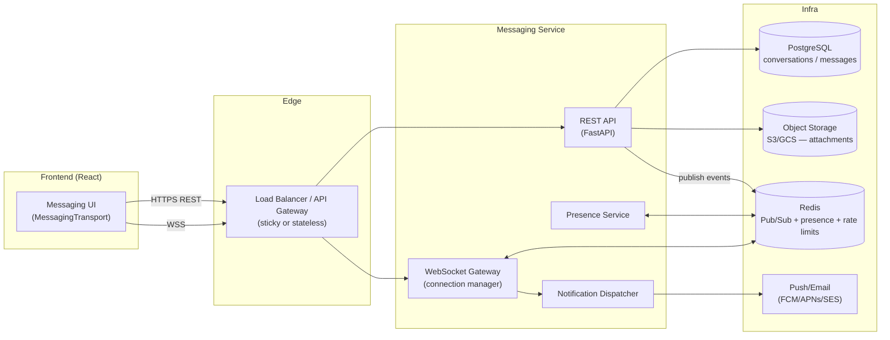
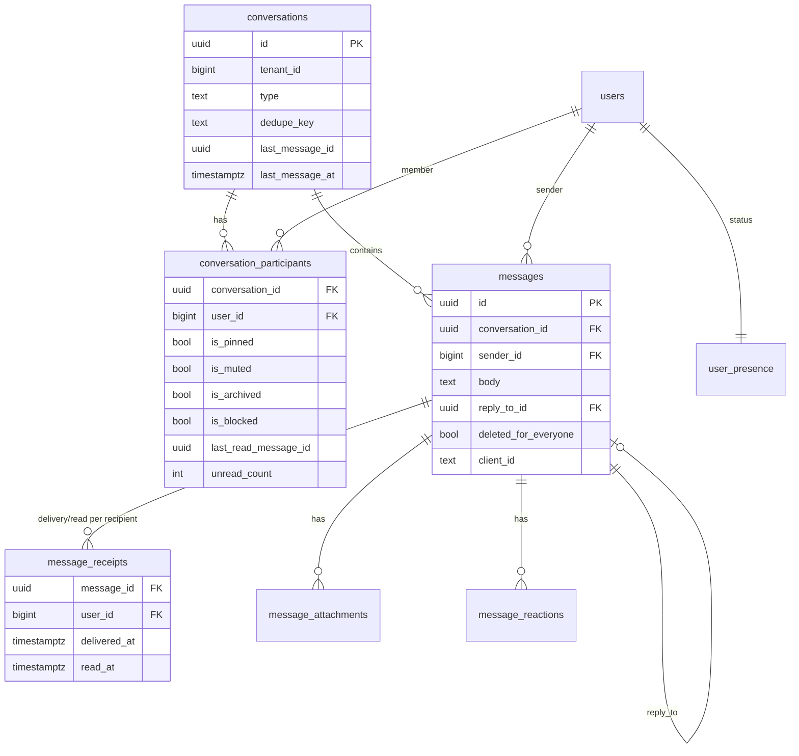
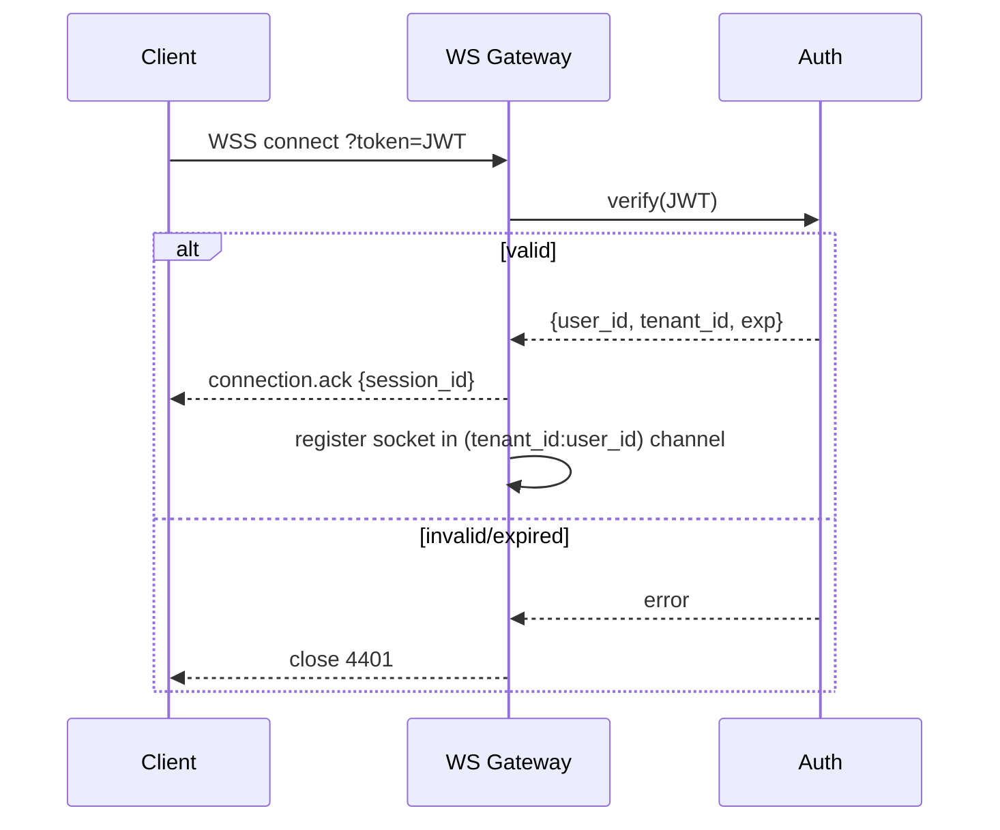
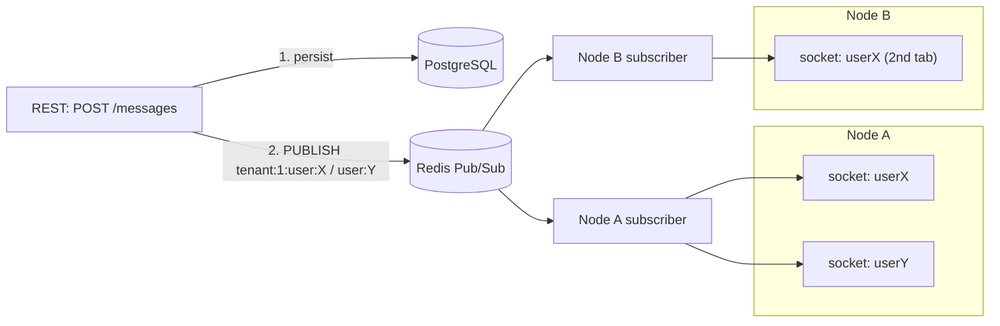
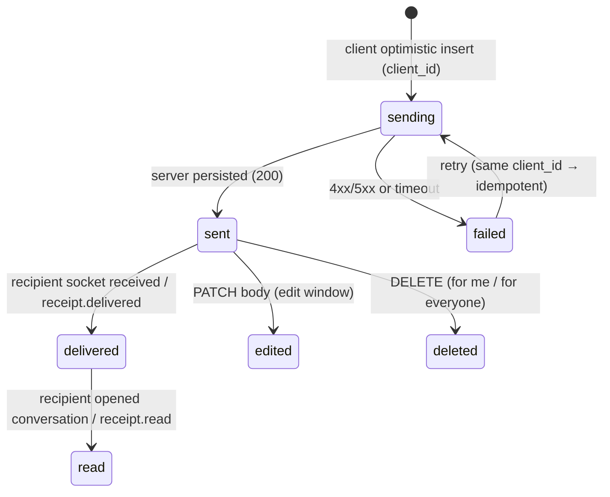
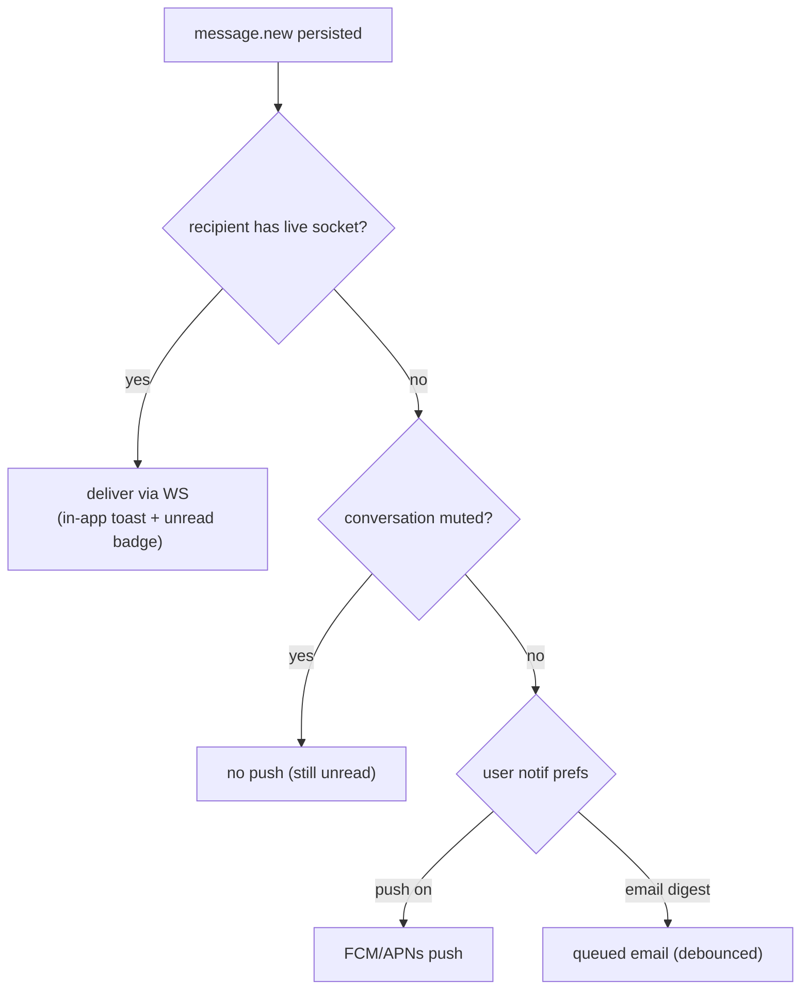
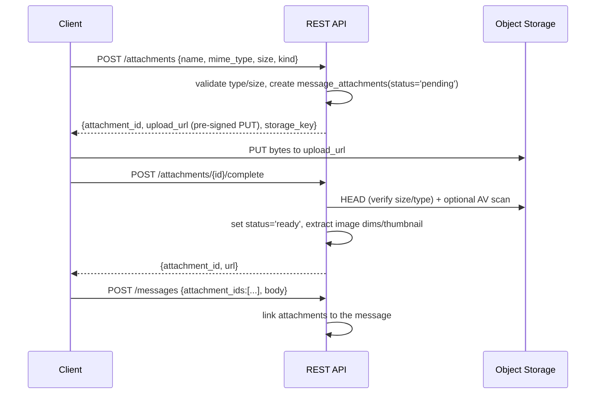
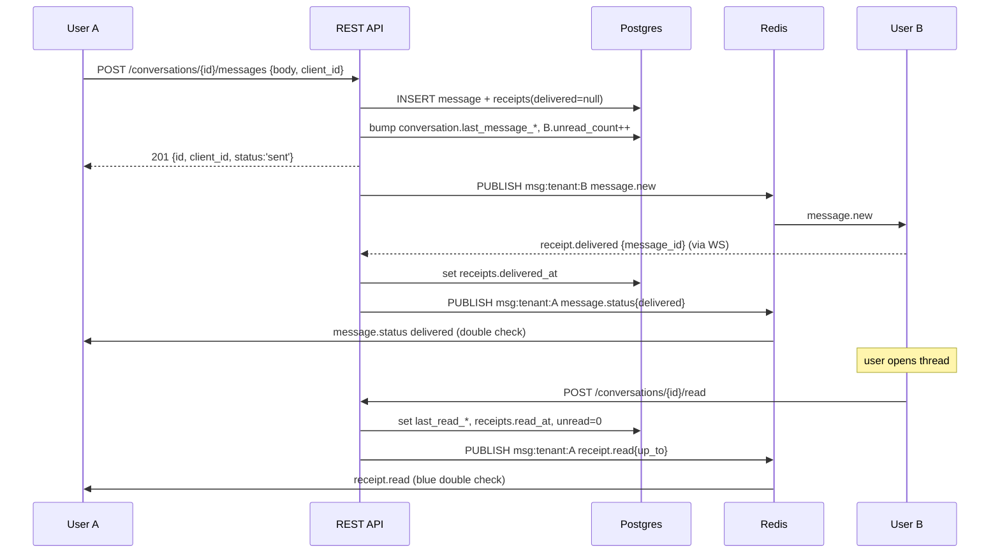
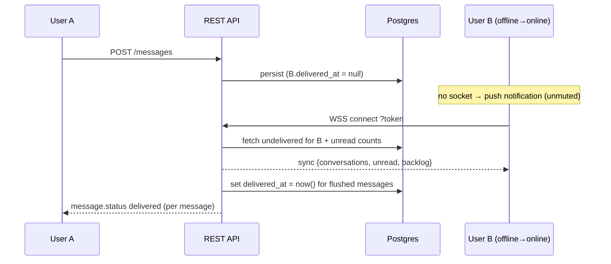

# DentC Direct Messaging — Backend Requirements

> **📌 Start with [`MESSAGING_BACKEND_HANDOFF.md`](./MESSAGING_BACKEND_HANDOFF.md)** — the consolidated,
> self-contained hand-off document for the backend team (architecture, schema, API, gaps, phasing,
> acceptance criteria, cut-over). This file remains as the long-form design rationale behind it.

**Status:** Frontend implemented and live-verified against a client-side simulation transport.
**Audience:** Backend engineering team. This document is the complete, self-contained specification to
implement the server side of the user-to-user Direct Messaging module.
**Frontend seam:** the UI talks to a single `MessagingTransport` interface
(`src/features/messaging/transport/types.ts`). A `RealMessagingTransport`
(`src/features/messaging/transport/realTransport.ts`) already targets the contract below and activates
with `VITE_MESSAGING_BACKEND=api`. Implementing this document + the companion
[`MESSAGING_API_CONTRACT.md`](../api-contracts/MESSAGING_API_CONTRACT.md) is sufficient to "go live" with
no frontend rewrite.

**Conventions (per repo CLAUDE.md):** all data/API field identifiers are **snake_case**; the backend is the
source of truth. Everything is **tenant-scoped** (`tenant_id`), mirroring the rest of the DentC API. Auth is
the existing JWT bearer scheme (`Authorization: Bearer <access_token>`); WebSocket auth uses the same token
via query string.

> Terminology: a **conversation** is a container for messages between a fixed set of participants. Phase 1
> ships **1:1 direct messages** only, but the schema is modeled for N participants so group chats/channels
> are an additive change (see §30).

---

## Table of Contents

1. [Overall System Architecture](#1-overall-system-architecture)
2. [Database Schema Design](#2-database-schema-design)
3. [Required Tables and Relationships](#3-required-tables-and-relationships)
4. [API Endpoints (REST + WebSocket)](#4-api-endpoints-rest--websocket)
5. [Authentication and Authorization Flow](#5-authentication-and-authorization-flow)
6. [Real-Time Communication Architecture](#6-real-time-communication-architecture)
7. [Message Lifecycle](#7-message-lifecycle)
8. [Conversation Management](#8-conversation-management)
9. [Read Receipts Implementation](#9-read-receipts-implementation)
10. [Delivery Acknowledgements](#10-delivery-acknowledgements)
11. [Typing Indicator Flow](#11-typing-indicator-flow)
12. [User Presence Tracking](#12-user-presence-tracking)
13. [Online/Offline Status Management](#13-onlineoffline-status-management)
14. [Notification Architecture](#14-notification-architecture)
15. [File Upload and Attachment Handling](#15-file-upload-and-attachment-handling)
16. [Media Storage Strategy](#16-media-storage-strategy)
17. [Pagination Strategy](#17-pagination-strategy)
18. [Search Implementation](#18-search-implementation)
19. [Security Considerations](#19-security-considerations)
20. [Rate Limiting and Abuse Prevention](#20-rate-limiting-and-abuse-prevention)
21. [Error Handling](#21-error-handling)
22. [Scalability Considerations](#22-scalability-considerations)
23. [Performance Optimization Recommendations](#23-performance-optimization-recommendations)
24. [Database Indexing Strategy](#24-database-indexing-strategy)
25. [Sequence Diagrams](#25-sequence-diagrams)
26. [API Request/Response Examples](#26-api-requestresponse-examples)
27. [WebSocket Event Definitions](#27-websocket-event-definitions)
28. [Validation Rules](#28-validation-rules)
29. [Permission Model](#29-permission-model)
30. [Future Extensibility](#30-future-extensibility)

---

## 1. Overall System Architecture

The messaging service is a set of REST endpoints for durable reads/writes plus a WebSocket gateway for
real-time fan-out. It is tenant-scoped and reuses DentC's existing auth (JWT) and user directory.



**Key ideas**

- **REST is the source of truth** for conversations/messages; the WebSocket layer is a delivery/notification
  channel, never the only path. Every real-time event has a corresponding durable REST state.
- **Redis Pub/Sub** decouples WebSocket nodes: any node can publish an event to a channel keyed by
  `tenant_id:user_id`; all nodes holding that user's sockets deliver it. This makes the WS tier horizontally
  scalable without sticky sessions for delivery (sticky is still nice-to-have for connection affinity).
- **Presence and rate-limit counters** live in Redis (fast, TTL-based).
- **Attachments** are uploaded directly to object storage; the DB stores only metadata + a storage key.

---

## 2. Database Schema Design

PostgreSQL. All tables carry `tenant_id` and are always filtered by it. Timestamps are `timestamptz`
(UTC). Primary keys are `bigint`/`uuid` (recommend UUIDv7 for messages so ids are time-sortable — this makes
keyset pagination trivial and avoids exposing counts).

```sql
-- A conversation container (1:1 today; N participants supported).
CREATE TABLE conversations (
  id              uuid PRIMARY KEY DEFAULT gen_random_uuid(),
  tenant_id       bigint NOT NULL,
  type            text   NOT NULL DEFAULT 'direct',   -- 'direct' | 'group' (future)
  title           text,                               -- null for 1:1 (derived from peer)
  -- Deterministic key for 1:1 dedupe: 'dm:' || least(a,b) || ':' || greatest(a,b)
  dedupe_key      text,
  created_by      bigint NOT NULL,
  last_message_id uuid,                               -- denormalized for list sorting
  last_message_at timestamptz,
  created_at      timestamptz NOT NULL DEFAULT now(),
  updated_at      timestamptz NOT NULL DEFAULT now()
);

-- Membership + per-user conversation state (pin/mute/archive/block/read cursor).
CREATE TABLE conversation_participants (
  id                 bigserial PRIMARY KEY,
  tenant_id          bigint NOT NULL,
  conversation_id    uuid   NOT NULL REFERENCES conversations(id) ON DELETE CASCADE,
  user_id            bigint NOT NULL,
  role               text   NOT NULL DEFAULT 'member',   -- 'member' | 'owner' (future groups)
  is_pinned          boolean NOT NULL DEFAULT false,
  is_muted           boolean NOT NULL DEFAULT false,
  is_archived        boolean NOT NULL DEFAULT false,
  is_blocked         boolean NOT NULL DEFAULT false,     -- this user blocked the other
  last_read_message_id uuid,                             -- read cursor
  last_read_at       timestamptz,
  unread_count       integer NOT NULL DEFAULT 0,         -- maintained on write (or computed)
  joined_at          timestamptz NOT NULL DEFAULT now(),
  left_at            timestamptz,
  UNIQUE (conversation_id, user_id)
);

-- A message.
CREATE TABLE messages (
  id                uuid PRIMARY KEY DEFAULT gen_random_uuid(),  -- UUIDv7 recommended
  tenant_id         bigint NOT NULL,
  conversation_id   uuid   NOT NULL REFERENCES conversations(id) ON DELETE CASCADE,
  sender_id         bigint NOT NULL,
  body              text   NOT NULL DEFAULT '',          -- markdown; may be '' if attachments-only
  reply_to_id       uuid   REFERENCES messages(id) ON DELETE SET NULL,
  forwarded_from    text,                                -- display name of original sender
  client_id         text,                                -- idempotency / optimistic de-dupe
  is_edited         boolean NOT NULL DEFAULT false,
  edited_at         timestamptz,
  deleted_for_everyone boolean NOT NULL DEFAULT false,   -- tombstone
  deleted_at        timestamptz,
  created_at        timestamptz NOT NULL DEFAULT now(),
  UNIQUE (conversation_id, client_id)                    -- idempotent sends
);

-- Per-recipient delivery/read state (supports N participants + accurate receipts).
CREATE TABLE message_receipts (
  id              bigserial PRIMARY KEY,
  tenant_id       bigint NOT NULL,
  message_id      uuid   NOT NULL REFERENCES messages(id) ON DELETE CASCADE,
  user_id         bigint NOT NULL,                       -- recipient
  delivered_at    timestamptz,
  read_at         timestamptz,
  UNIQUE (message_id, user_id)
);

-- Attachment metadata (bytes live in object storage).
CREATE TABLE message_attachments (
  id            uuid PRIMARY KEY DEFAULT gen_random_uuid(),
  tenant_id     bigint NOT NULL,
  message_id    uuid   REFERENCES messages(id) ON DELETE CASCADE,  -- null until message committed
  uploader_id   bigint NOT NULL,
  kind          text   NOT NULL,                         -- 'image' | 'file'
  name          text   NOT NULL,
  mime_type     text   NOT NULL,
  size_bytes    bigint NOT NULL,
  storage_key   text   NOT NULL,                         -- object storage path
  width         integer,
  height        integer,
  status        text   NOT NULL DEFAULT 'pending',       -- 'pending' | 'ready' | 'blocked'
  created_at    timestamptz NOT NULL DEFAULT now()
);

-- Emoji reactions.
CREATE TABLE message_reactions (
  id            bigserial PRIMARY KEY,
  tenant_id     bigint NOT NULL,
  message_id    uuid   NOT NULL REFERENCES messages(id) ON DELETE CASCADE,
  user_id       bigint NOT NULL,
  emoji         text   NOT NULL,
  created_at    timestamptz NOT NULL DEFAULT now(),
  UNIQUE (message_id, user_id, emoji)
);

-- Per-user presence snapshot (also mirrored in Redis for speed).
CREATE TABLE user_presence (
  tenant_id     bigint NOT NULL,
  user_id       bigint NOT NULL,
  status        text   NOT NULL DEFAULT 'offline',       -- 'online' | 'away' | 'offline'
  last_seen_at  timestamptz,
  updated_at    timestamptz NOT NULL DEFAULT now(),
  PRIMARY KEY (tenant_id, user_id)
);

-- Optional: report/abuse records (see §20).
CREATE TABLE message_reports (
  id            bigserial PRIMARY KEY,
  tenant_id     bigint NOT NULL,
  reporter_id   bigint NOT NULL,
  reported_user_id bigint,
  message_id    uuid,
  reason        text NOT NULL,
  details       text,
  created_at    timestamptz NOT NULL DEFAULT now()
);
```

---

## 3. Required Tables and Relationships



**Relationship notes**

- `conversations 1—N conversation_participants` — for 1:1 exactly two rows; `dedupe_key` guarantees a single
  conversation per user pair (unique partial index, §24).
- `messages 1—N message_receipts` — one row per recipient. For 1:1 that's one receipt row; keeping it a table
  (not two columns on `messages`) means group chats need no schema change.
- `messages 0—1 messages (reply_to_id)` — self-referential for replies; `ON DELETE SET NULL` so deleting a
  quoted message doesn't cascade.
- `message_attachments.message_id` is nullable so a client can upload **before** the message row is committed
  (see §15), then the attachment is linked on send.

---

## 4. API Endpoints (REST + WebSocket)

All REST paths are prefixed `/api/v1/messaging`. All are tenant-scoped from the JWT. Full request/response
shapes are in the [API Contract](../api-contracts/MESSAGING_API_CONTRACT.md); a condensed list:

| Method | Path | Purpose |
|---|---|---|
| `GET` | `/conversations` | List my conversations (paginated, includes unread + last message). |
| `POST` | `/conversations` | Get-or-create a 1:1 conversation (`{ participant_id }`), idempotent. |
| `GET` | `/conversations/{id}` | Fetch one conversation (metadata + my participant state). |
| `PATCH` | `/conversations/{id}` | Update my flags: `pinned` / `muted` / `archived` / `blocked`. |
| `DELETE` | `/conversations/{id}` | Remove the conversation from **my** list (soft, per-user). |
| `POST` | `/conversations/{id}/read` | Mark read up to latest (or `{ up_to_message_id }`). |
| `GET` | `/conversations/{id}/messages` | Message history (keyset pagination via `before`/`limit`). |
| `POST` | `/conversations/{id}/messages` | Send a message (`body`, `attachment_ids`, `reply_to_id`, `client_id`). |
| `PATCH` | `/conversations/{id}/messages/{mid}` | Edit `body` (sender only, within edit window). |
| `DELETE` | `/conversations/{id}/messages/{mid}?for_everyone=` | Delete for me / for everyone. |
| `POST` | `/conversations/{id}/messages/{mid}/reactions` | Toggle `{ emoji }`; returns full reaction set. |
| `POST` | `/messages/{mid}/forward` | Forward to `{ participant_ids: [] }` (server copies body/attachments). |
| `GET` | `/presence?user_ids=` | Presence snapshot for a set of users. |
| `GET` | `/users?search=` | (Existing `/api/v1/users`) — directory for the "New message" picker. |
| `POST` | `/attachments` | Request an upload (returns a pre-signed URL + attachment id). |
| `POST` | `/attachments/{id}/complete` | Mark an upload finished; server validates + sets `ready`. |
| `GET` | `/search?q=` | Full-text search across my messages/conversations. |
| `POST` | `/reports` | Report a user/message for abuse. |

**WebSocket:** `wss://<host>/api/v1/messaging/ws?token=<access_token>` — bidirectional; events in §27.

---

## 5. Authentication and Authorization Flow

- **REST:** existing `Authorization: Bearer <jwt>`; middleware resolves `user_id` + `tenant_id`. Every query
  filters by `tenant_id` and, for message/conversation reads, asserts the caller is a participant.
- **WebSocket:** the browser cannot set headers on the WS handshake, so the token is passed as
  `?token=<jwt>` (same pattern as the retired AI-chat socket). The gateway validates it **on connect**,
  binds the socket to `(tenant_id, user_id)`, and rejects with close code `4401` if invalid/expired.
- **Token expiry mid-connection:** the gateway tracks token `exp`; on expiry it emits an `auth.expired` event
  and closes with `4401` so the client re-auths and reconnects with a fresh token. (The client already
  reads `access_token` from `localStorage` and reconnects with backoff.)



**Authorization rules** are the permission model in §29. In short: you may only read/write a conversation you
are a participant of; you may only edit/delete your own messages (delete-for-me is allowed for any message
you can see).

---

## 6. Real-Time Communication Architecture

Use a **WebSocket gateway + Redis Pub/Sub** fan-out. Socket.IO is acceptable but a plain WS + JSON envelope
(matching §27) keeps parity with the existing client and avoids a client dependency.



**Delivery flow:** a write (REST or WS) persists to Postgres, then publishes the resulting event to each
recipient's Redis channel `msg:{tenant_id}:{user_id}`. Every gateway node subscribes to the channels for the
users it currently holds sockets for and forwards the event to those sockets. This means:

- No sticky sessions required for correctness (a user can have sockets on different nodes/tabs).
- Horizontal scale = add gateway nodes; Redis handles fan-out.
- If a recipient has **no** live socket, the Notification Dispatcher (§14) handles push/email and the message
  is simply unread until they connect (history is durable in Postgres).

**Ordering:** order messages by `created_at` then `id` (UUIDv7 = time-sortable). The client de-dupes by `id`
and reconciles optimistic sends via `client_id`.

---

## 7. Message Lifecycle



- **sending** — client renders optimistically with a temporary `client_id`; not yet acknowledged.
- **sent** — `POST /messages` succeeded; server assigns the canonical `id`, echoes `client_id` so the client
  swaps the optimistic row.
- **delivered** — at least one recipient's socket acknowledged receipt (or a `message_receipts.delivered_at`
  was written). For 1:1, that's the peer.
- **read** — recipient marked read (`POST /read` or `receipt.read`), setting `read_at`.
- **failed** — non-2xx or client timeout; client shows retry. Retries reuse `client_id` → the unique
  `(conversation_id, client_id)` constraint makes the send idempotent (no duplicates).

Status shown on the sender's own bubble is the **min** state across recipients (for 1:1 it's just the peer's).

---

## 8. Conversation Management

- **Get-or-create (1:1):** `POST /conversations {participant_id}` computes
  `dedupe_key = 'dm:' || least(me,peer) || ':' || greatest(me,peer)` and upserts; returns the existing
  conversation if present. This makes "start a chat" idempotent regardless of who initiates.
- **Per-user flags** (`pinned`, `muted`, `archived`, `blocked`) live on `conversation_participants`, so each
  side controls their own view. `PATCH /conversations/{id}` updates only the caller's row.
- **Delete** is **per-user soft-delete** (set `left_at`, hide from list) — never a hard delete of shared
  history, so the other participant keeps their copy. A future retention job can hard-delete orphaned
  conversations where all participants have left.
- **Drafts** are intentionally **client-side** (localStorage) even with a real backend; do not persist server
  side (the transport's `saveDraft` is a no-op in `realTransport`).
- **Muting** suppresses push/badge for that conversation but still delivers messages.
- **Blocking** prevents the blocked user from sending to the blocker (server rejects with `403 BLOCKED`), and
  hides the blocker's presence from the blocked user.

---

## 9. Read Receipts Implementation

- Client calls `POST /conversations/{id}/read` (optionally `{ up_to_message_id }`; default = latest) when the
  user views the thread.
- Server sets `conversation_participants.last_read_message_id/last_read_at`, resets `unread_count = 0`, and
  writes `message_receipts.read_at = now()` for all messages `<= up_to` sent by others.
- Server publishes `receipt.read { conversation_id, reader_id, up_to_message_id, read_at }` to the **senders**
  of those messages. Their client flips affected outgoing bubbles to **read** (blue double-check).
- Privacy option (future): a per-user "send read receipts" setting; when off, suppress the outbound
  `receipt.read` and show only `delivered` to peers.

---

## 10. Delivery Acknowledgements

- When a gateway node delivers a `message.new` to a recipient's socket, the client responds with a lightweight
  `receipt.delivered { message_id }` WS frame (or the server writes it on successful socket send).
- Server sets `message_receipts.delivered_at` (once) and publishes `message.status { message_id, status:
  'delivered' }` to the **sender**.
- If the recipient is offline, `delivered_at` stays null; it is set the moment they connect and the backlog is
  flushed (see §12/§25 "reconnect"). This is what distinguishes **sent** (server has it) from **delivered**
  (recipient's device has it) in the UI.

---

## 11. Typing Indicator Flow

Typing is **ephemeral** and must **not** touch Postgres.

```mermaid
sequenceDiagram
  participant A as User A (typing)
  participant GW as WS Gateway
  participant R as Redis
  participant B as User B
  A->>GW: typing {conversation_id, is_typing:true}
  GW->>R: PUBLISH msg:tenant:B  typing{from:A,...}
  R->>GW: (B's node)
  GW->>B: typing {conversation_id, user_id:A, is_typing:true}
  Note over B: show indicator; auto-hide after ~5s TTL
  A->>GW: typing {is_typing:false}  (debounced ~2.5s idle, or on send)
  GW->>B: typing {is_typing:false}
```

- Client emits `is_typing:true` on first keystroke, then `false` after ~2.5s idle or on send (already
  implemented in `useConversation.notifyTyping`).
- The receiver auto-expires the indicator after ~5s in case the `false` is lost.
- Server does not persist; it only fans out to other participants' sockets. Rate-limit typing frames (§20).

---

## 12. User Presence Tracking

Presence is Redis-first (fast, TTL) with a periodic Postgres snapshot for durability/analytics.

- On WS connect: set Redis `presence:{tenant}:{user} = online` with a TTL (e.g. 45s); publish
  `presence { user_id, status:'online', last_seen }` to interested peers.
- **Heartbeat:** client sends `ping` every ~30s (already implemented); gateway refreshes the TTL. Missing
  heartbeats let the key expire → user considered offline.
- `away` is driven by the client on tab `visibilitychange` (already implemented: `setPresence('away')` on
  hidden, `'online'` on visible). The server relays it.
- On disconnect / TTL expiry: set `offline`, write `user_presence.last_seen_at = now()`, publish `presence`.
- **Who receives presence:** to avoid broadcasting every user's presence to everyone, only publish a user's
  presence to users who share a conversation with them (their "contacts"), plus anyone actively viewing the
  directory (subscribe on demand). `GET /presence?user_ids=` covers the initial directory snapshot.

---

## 13. Online/Offline Status Management

| Status | Set when | Cleared when |
|---|---|---|
| `online` | WS connected + recent heartbeat, tab visible | heartbeat TTL expires / disconnect |
| `away` | tab hidden (`visibilitychange`) while connected | tab visible again |
| `offline` | no live socket / heartbeat expired | next connect |

- **Multiple tabs/devices:** a user is `online` if **any** socket is live (reference-count sockets per user in
  Redis; only flip to `offline` when the count hits zero).
- **`last_seen_at`** is written on transition to `offline` and shown as "last seen …" when the peer is offline.
- Graceful degradation: if Redis is unavailable, fall back to "unknown/offline" rather than erroring the
  whole conversation load.

---

## 14. Notification Architecture



- **In-app** (implemented client-side): toast + unread badge + document-title count + optional sound; skipped
  for the active/open thread and muted conversations.
- **Out-of-app:** a Notification Dispatcher consumes `message.new` for recipients with **no** live socket and
  an **unmuted** conversation, and sends push (FCM/APNs) and/or a debounced email digest, honoring per-user
  notification preferences (reuse the My Page notification prefs surface if desired).
- De-dupe: never push for a message the user already saw via WS; coalesce bursts (e.g. one push per
  conversation per N seconds).

---

## 15. File Upload and Attachment Handling

Two-phase, direct-to-storage upload (bytes never transit the API server):



- Validate **before** issuing the pre-signed URL: allowed MIME types (images, PDF, common docs), max size
  (recommend 25 MB for files, 10 MB for images — the simulation caps at 3 MB inline; that cap is a demo-only
  limitation, not a product requirement). Reject executables/scripts.
- Optional antivirus scan on `complete`; mark `status='blocked'` on failure and never link it.
- Generate server-side thumbnails for images; store `width`/`height`.
- Serve downloads via short-lived pre-signed GET URLs (never public buckets).

---

## 16. Media Storage Strategy

- **Object storage** (S3/GCS/Azure Blob) is the system of record for bytes; Postgres holds only metadata +
  `storage_key`.
- Key layout: `tenant/{tenant_id}/conversations/{conversation_id}/{attachment_id}/{filename}`.
- **Access control:** private buckets; all reads/writes via pre-signed URLs scoped to the specific object and
  a short expiry (e.g. 5 min). Authorize the pre-sign by checking the requester is a participant of the
  attachment's conversation.
- **Lifecycle:** thumbnails in a `derived/` prefix; optional lifecycle policy to transition old media to
  cheaper storage; deleting a message for-everyone should schedule its attachments for deletion (grace period
  for audit).
- **CDN:** front image reads with a CDN using signed URLs for performance.

---

## 17. Pagination Strategy

- **Conversations list:** page/size (1-based) like the rest of the DentC API, ordered by `pinned desc,
  last_message_at desc`. Return `{ items, meta: { page, size, total, pages } }` to match existing
  `PaginatedResponse*` shapes.
- **Messages (history):** **keyset (cursor) pagination**, not offset — a hot thread mutates constantly and
  offset paging skips/dupes. Query `WHERE conversation_id = ? AND id < :before ORDER BY id DESC LIMIT :limit`,
  then reverse for display. Response: `{ items, has_more, cursor }` where `cursor` = oldest returned `id`.
  The client already consumes exactly this shape (`Paginated<DirectMessage>` with `before`/`cursor`).
- Default page size 30 messages; cap at 100.

---

## 18. Search Implementation

- **Phase 1 (DB):** Postgres full-text search over `messages.body` scoped to the caller's conversations:
  a `tsvector` generated column + GIN index (§24). `GET /messaging/search?q=` returns matching messages
  grouped by conversation with a snippet + highlight offsets.
- Always constrain by `tenant_id` and participant membership (never leak messages from conversations the
  caller isn't in).
- **People search** for the "New message" picker reuses the existing `GET /api/v1/users?search=` (already
  wired — the frontend calls it directly).
- **Phase 2 (scale):** if volume warrants, mirror messages into OpenSearch/Elasticsearch for ranked,
  typo-tolerant search; keep Postgres FTS as the fallback.

---

## 19. Security Considerations

- **Tenant isolation:** every query filters `tenant_id`; never trust a client-supplied tenant. Cross-tenant
  messaging is forbidden (a user may only start conversations with users in their own tenant).
- **Authorization on every access:** participant check on all conversation/message/attachment reads and
  writes; ownership check on edit/delete-for-everyone.
- **Transport:** TLS everywhere (HTTPS/WSS). Validate WS `Origin` against an allowlist.
- **Input handling:** treat `body` as untrusted. Store raw markdown; the client renders with a **sanitizing**
  markdown renderer (no raw HTML, `target="_blank" rel="noopener noreferrer"` on links) — server should also
  strip/deny control characters and enforce length. Prevent stored XSS by never returning HTML.
- **IDOR:** use UUIDs for conversation/message/attachment ids and still authorize (don't rely on
  unguessability alone).
- **Attachments:** MIME/type allowlist, size caps, AV scan, private storage, signed URLs, `Content-Disposition:
  attachment` for downloads, and never execute uploaded content.
- **Audit:** log message edits/deletes and reports; consider retention/e-discovery requirements for a
  healthcare context (this is a PMS — messages may reference PHI; see §29 note).
- **PHI/compliance:** since staff may discuss patients, treat message content as potentially sensitive — apply
  the same encryption-at-rest, access logging, and retention policies as other PHI-adjacent data.

---

## 20. Rate Limiting and Abuse Prevention

- **Redis token buckets per user** (and per IP for connects):
  - Send message: e.g. 20 / 10s burst, 600 / hour sustained.
  - Typing frames: coalesce; drop > 1 / 2s per conversation.
  - Reactions/edits: e.g. 60 / min.
  - New-conversation creation: e.g. 30 / hour (anti-spam).
  - WS connects: e.g. 10 / min per user.
- Exceeding a limit returns `429 RATE_LIMITED` (REST) or a `error{code:'RATE_LIMITED'}` WS frame with a
  `retry_after` hint.
- **Blocking** (§8) and **reporting** (`POST /reports`) give users recourse; repeated reports can auto-flag
  for admin review.
- **Content limits:** max body length (see §28); max attachments per message; max total attachment bytes per
  message.

---

## 21. Error Handling

Uniform error envelope (matches the rest of the DentC API's `ErrorResponse`):

```json
{ "error": { "code": "MESSAGE_TOO_LONG", "message": "Message exceeds 8000 characters.", "details": null } }
```

| HTTP | code | when |
|---|---|---|
| 400 | `VALIDATION_ERROR` | malformed body / bad params |
| 401 | `UNAUTHENTICATED` | missing/invalid/expired token |
| 403 | `FORBIDDEN` / `BLOCKED` | not a participant / blocked by recipient |
| 404 | `NOT_FOUND` | conversation/message not found in tenant |
| 409 | `CONFLICT` | idempotency/version conflict |
| 413 | `ATTACHMENT_TOO_LARGE` | upload over cap |
| 415 | `UNSUPPORTED_MEDIA_TYPE` | disallowed MIME |
| 429 | `RATE_LIMITED` | throttled (+ `retry_after`) |
| 500 | `INTERNAL` | unexpected |

- WS errors use `{ type: 'error', error: { code, message } }` and never crash the socket; auth failures close
  with `4401`.
- Sends are **idempotent** via `client_id` so client retries after a network blip don't duplicate.

---

## 22. Scalability Considerations

- **Stateless REST** behind an autoscaling group; **WS gateway** scales horizontally with Redis Pub/Sub
  fan-out (no shared in-process state; presence + routing in Redis).
- **Connection density:** budget ~ few thousand sockets per node; scale nodes on concurrent-connection
  metrics. Use a WS-friendly server (uvicorn/uvloop, or a Go/Elixir gateway if density is very high).
- **Database:** conversations/messages grow unbounded — partition `messages` by month (range) or by
  `tenant_id` (hash) once large; keep hot indexes lean (§24). Read replicas for history/search.
- **Redis:** cluster mode for Pub/Sub + presence at scale; presence is TTL-bounded so memory is predictable.
- **Backpressure:** cap per-socket send queue; drop typing/presence (ephemeral) before message events under
  pressure; never drop a persisted `message.new` (it's recoverable via REST on reconnect).
- **Idempotency + at-least-once fan-out:** clients de-dupe by `id`, so duplicate WS deliveries are safe.

---

## 23. Performance Optimization Recommendations

- **Denormalize** `last_message_id/last_message_at` and `unread_count` onto `conversation_participants` so the
  conversation list is a single indexed query (no N+1 across messages).
- **Keyset pagination** for history (§17) — avoids deep-offset scans.
- **Batch receipts:** `POST /read` sets receipts in one `UPDATE ... WHERE message_id IN (...)`, and publishes a
  single `receipt.read` with `up_to_message_id` rather than one event per message.
- **Cache** presence and directory results (short TTL) in Redis.
- **Avoid chatty WS:** coalesce typing; heartbeat at 30s; send presence deltas only to contacts.
- **Connection warm-up:** on WS connect, send a compact "sync" payload (unread counts + latest message per
  conversation) so the client doesn't need N REST calls.
- **Thumbnails + CDN** for images; lazy-load full images on demand.

---

## 24. Database Indexing Strategy

```sql
-- 1:1 dedupe: one direct conversation per user pair per tenant.
CREATE UNIQUE INDEX uq_conv_dedupe ON conversations (tenant_id, dedupe_key)
  WHERE type = 'direct' AND dedupe_key IS NOT NULL;

-- Conversation list for a user, sorted by recency (pinned handled in query).
CREATE INDEX ix_participants_user ON conversation_participants (tenant_id, user_id);
-- Fast membership + flag lookups.
CREATE INDEX ix_participants_conv ON conversation_participants (conversation_id, user_id);

-- Message history keyset scan (id is time-sortable UUIDv7).
CREATE INDEX ix_messages_conv_id ON messages (conversation_id, id DESC);
CREATE INDEX ix_messages_conv_created ON messages (conversation_id, created_at DESC);

-- Idempotent sends.
CREATE UNIQUE INDEX uq_messages_client ON messages (conversation_id, client_id)
  WHERE client_id IS NOT NULL;

-- Receipts per message / per user backlog.
CREATE INDEX ix_receipts_user_undelivered ON message_receipts (user_id) WHERE delivered_at IS NULL;
CREATE INDEX ix_receipts_message ON message_receipts (message_id);

-- Reactions / attachments by message.
CREATE INDEX ix_reactions_message ON message_reactions (message_id);
CREATE INDEX ix_attachments_message ON message_attachments (message_id);

-- Full-text search over message bodies (scoped by conversation in the query).
ALTER TABLE messages ADD COLUMN body_tsv tsvector
  GENERATED ALWAYS AS (to_tsvector('english', coalesce(body,''))) STORED;
CREATE INDEX ix_messages_body_tsv ON messages USING GIN (body_tsv);

-- Presence lookups.
CREATE INDEX ix_presence_tenant ON user_presence (tenant_id, status);
```

---

## 25. Sequence Diagrams

**Send → deliver → read (both participants online):**



**Recipient offline → reconnect backlog:**



**Typing** and **auth** diagrams are in §11 and §5.

---

## 26. API Request/Response Examples

**Create/get a 1:1 conversation**

```http
POST /api/v1/messaging/conversations
Authorization: Bearer <jwt>
Content-Type: application/json

{ "participant_id": 83867 }
```
```json
{
  "id": "0f2b…",
  "type": "direct",
  "participant_ids": ["12", "83867"],
  "peer": { "id": "83867", "name": "Dhileep Jinna", "role": "provider", "avatar_url": null },
  "unread_count": 0, "pinned": false, "muted": false, "archived": false, "blocked": false,
  "last_message": null,
  "created_at": "2026-07-19T15:32:00Z", "updated_at": "2026-07-19T15:32:00Z"
}
```

**Send a message**

```http
POST /api/v1/messaging/conversations/0f2b…/messages
{ "body": "Is the 2pm crown appointment confirmed?", "client_id": "msg_k2a…", "reply_to_id": null,
  "attachment_ids": [] }
```
```json
{
  "id": "018f…",                       // UUIDv7
  "conversation_id": "0f2b…",
  "sender_id": "12",
  "body": "Is the 2pm crown appointment confirmed?",
  "status": "sent",
  "client_id": "msg_k2a…",
  "attachments": [], "reactions": [], "reply_to": null,
  "created_at": "2026-07-19T15:32:04Z"
}
```

**Message history (keyset)**

```http
GET /api/v1/messaging/conversations/0f2b…/messages?before=018f…&limit=30
```
```json
{ "items": [ /* older messages, ascending */ ], "has_more": true, "cursor": "018e…" }
```

**Toggle a reaction**

```http
POST /api/v1/messaging/conversations/0f2b…/messages/018f…/reactions
{ "emoji": "👍" }
```
```json
{ "reactions": [ { "emoji": "👍", "user_ids": ["83867"] } ] }
```

**Mark read**

```http
POST /api/v1/messaging/conversations/0f2b…/read
{ "up_to_message_id": "018f…" }
```
```json
{ "conversation_id": "0f2b…", "unread_count": 0, "last_read_message_id": "018f…" }
```

---

## 27. WebSocket Event Definitions

JSON envelopes; `type` discriminates. These map 1:1 to `MessagingEvent` in the frontend
(`realTransport.onServerEvent`). See the [API Contract](../api-contracts/MESSAGING_API_CONTRACT.md) for the
full catalogue.

**Server → Client**

| type | payload | meaning |
|---|---|---|
| `connection.ack` | `{ session_id, server_time }` | handshake ok |
| `sync` | `{ conversations[], unread[] }` | warm-up snapshot on connect |
| `message.new` | `{ conversation_id, message }` | new inbound/outbound message |
| `message.updated` | `{ conversation_id, message }` | edited message |
| `message.deleted` | `{ conversation_id, message_id, for_everyone }` | deletion |
| `message.status` | `{ conversation_id, message_id, status }` | sent/delivered/read transition |
| `receipt.read` | `{ conversation_id, reader_id, up_to_message_id, read_at }` | read receipt |
| `reaction.updated` | `{ conversation_id, message_id, reactions[] }` | reactions changed |
| `typing` | `{ conversation_id, user_id, is_typing }` | typing indicator |
| `presence` | `{ user_id, status, last_seen }` | presence change |
| `conversation.updated` | `{ conversation }` | flags/last message changed |
| `error` | `{ error: { code, message } }` | recoverable error |

**Client → Server**

| type | payload | meaning |
|---|---|---|
| `ping` | `{}` | heartbeat (keeps presence TTL alive) |
| `typing` | `{ conversation_id, is_typing }` | typing state |
| `receipt.delivered` | `{ message_id }` | ack delivery |
| `presence` | `{ status }` | online/away |

> Writes that mutate durable state (send/edit/delete/react/read) go over **REST** for reliability + idempotency;
> the WS channel carries the resulting broadcasts. `typing`, `ping`, `presence`, and `receipt.delivered` are
> the only client→server WS frames.

---

## 28. Validation Rules

- `body`: max **8000** chars; may be empty **only if** `attachment_ids` is non-empty. Strip NULs/control
  chars. Markdown stored raw, rendered sanitized.
- `client_id`: ≤ 64 chars, unique per conversation (idempotency).
- `reply_to_id` / `attachment_ids`: must reference messages/attachments in the **same** conversation/tenant
  and belong to a message the caller can see; else `422`.
- `emoji`: single grapheme from an allowlist; ≤ 16 bytes.
- Attachments: ≤ 10/message; per-file ≤ 25 MB; total ≤ 50 MB/message; MIME allowlist (§15).
- `participant_id`: must be an active user in the **same tenant**, not self; must not have blocked the caller.
- Conversation flags (`pinned/muted/archived/blocked`): booleans only.
- All ids validated as UUID/int; unknown → `404` (not `400`, to avoid enumeration signals — but keep tenant
  scoping so cross-tenant is always `404`).

---

## 29. Permission Model

| Action | Allowed for |
|---|---|
| Read conversation / messages | participants only |
| Send message | participants; sender not blocked by recipient; conversation not archived-for-recipient does **not** block delivery |
| Edit message | **sender only**, within edit window (e.g. 15 min), not deleted |
| Delete **for me** | any participant (hides their own copy) |
| Delete **for everyone** | **sender only**, within window (e.g. 60 min) → tombstone |
| React | participants |
| Pin/mute/archive/block/delete-conversation | affects **only the caller's** participant row |
| Start conversation | any active user with another active user **in the same tenant** |
| View presence | users who share a conversation, or during an explicit directory lookup |

- **Roles:** all authenticated staff can message each other by default. If the practice wants restrictions
  (e.g. front-desk cannot DM providers), add a policy layer keyed on `users.role` — out of scope for Phase 1
  but the participant check is the single enforcement point to extend.
- **Admin/audit:** consider an admin/compliance read path for e-discovery (healthcare context), gated by a
  distinct permission and fully audit-logged.

---

## 30. Future Extensibility

The schema is deliberately group-ready; each item below is **additive**:

- **Group chats / channels:** `conversations.type='group'`, `title`, and >2 `conversation_participants`
  rows already supported. Add `role='owner'`, add/remove-member endpoints, and a `channels` flavor
  (public/joinable). Receipts already per-recipient. The frontend's `participant_ids[]`/`peer` model
  generalizes (peer becomes a members list).
- **Threads / replies-in-thread:** `reply_to_id` exists; add a `thread_root_id` for threaded views.
- **Voice/video calls:** add a signaling channel (WebRTC SDP/ICE relayed over the same WS gateway) + a `calls`
  table; the UI already has placeholder call affordances (currently toast "planned").
- **Message pinning within a conversation, starred messages, folders/labels.**
- **Rich link previews / unfurling** (server-side fetch + cache).
- **Scheduled messages, message expiry / disappearing messages.**
- **Cross-device sync & multi-tenant federation** (e.g. messaging across affiliated practices) — would relax
  the strict tenant scoping behind an explicit, audited policy.
- **E2E encryption** for highly sensitive threads (key management out of scope; schema stores ciphertext in
  `body` transparently).
- **Bots/automation** (appointment reminders posting into a conversation) via a service-account sender.

---

### Appendix — Frontend integration checklist for "go live"

1. Implement the endpoints in §4 / §26 and WS events in §27 exactly (snake_case).
2. Set `VITE_MESSAGING_BACKEND=api` in the frontend env — this swaps `LocalMessagingTransport` for
   `RealMessagingTransport` with **no UI changes**.
3. The frontend already: reads `access_token` from `localStorage`, reconnects with backoff, de-dupes by `id`,
   reconciles optimistic sends by `client_id`, paginates history by `before`/`cursor`, and renders
   `sent/delivered/read` ticks, typing, presence, reactions, replies, forwards, edits, deletes.
4. Attachments: point `fileToAttachment` at the two-phase upload (§15) instead of inlining data URLs (the one
   place to change is `src/features/messaging/messagingService.ts`).
